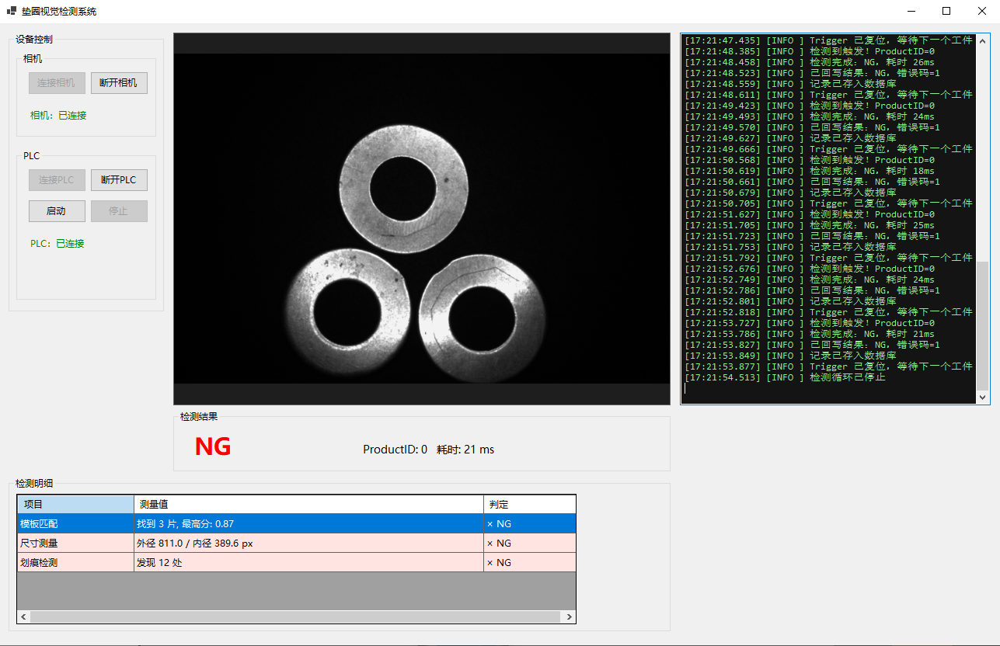

## 界面截图

# 垫圈视觉检测系统（HaspDemo）

基于 **WinForms + 海康工业相机 + 西门子 S7-1500 + MVTec HALCON** 的垫圈外观检测演示项目，
采用多层解耦架构，各层通过接口通信，可独立替换相机/算法/存储实现。

## 功能特性

- PLC 触发拍照：S7-1500 置位信号 → 自动取图 → Halcon 检测 → 结果回写 PLC → 检测记录入库
- 设备状态机管理：连接/断线自动重连，状态幂等切换
- 检测失败不阻塞产线：相机/算法异常时按约定错误码判 NG 并继续流转
- 运行日志落盘 + 检测记录持久化到 SQL Server
- UI 实时显示设备状态与检测结果（事件驱动，业务层不依赖界面）

## 项目结构
HaspDemo.Core 契约层：接口(ICameraService/IPLCService/IDetectAlgorithm…)与实体
HaspDemo.Devices 设备层：HikCamera(海康SDK)、S7Plc(S7netplus)
HaspDemo.Vision 算法层：HalconWasherInspector、HalconImageHelper
HaspDemo.Applicationsss 业务调度层：DetectionService(触发→拍照→检测→写回→存库→通知)
HaspDemo.Persistence 存储层：InspectRecordRepository(SQL Server)、FileLogService
HaspDemo.UI 界面层：MainForm

依赖方向全部指向 Core，通过 Program.cs（组合根）统一注册与组装，
替换任一硬件厂商或算法库只需新写实现类 + 改一行注册代码。

## 环境要求（克隆后必须先安装）

> 本仓库不含任何 SDK 二进制文件，编译前请自行安装以下组件：

1. **海康 MVS 客户端**（含开发组件）
   下载：https://www.hikrobotics.com/cn/machinevision/service/download
   安装后若 `MvCameraControl.Net` 引用报红：
   右键引用 → 浏览 → 指向 `C:\Program Files (x86)\MVS\Development\DotNet\MvCameraControl.Net.dll`

2. **MVTec HALCON**（需自行获取授权，本项目基于 21.xx 开发）
   安装后若 `halcondotnet` 引用报红：
   右键引用 → 浏览 → 指向 `<HALCON安装目录>\bin\dotnet35\halcondotnet.dll`

3. **SQL Server**（2016 及以上）
   创建数据库后，修改 `HaspDemo.UI/Program.cs` 中的连接字符串指向本机实例。

4. **.NET**（按 .csproj 中 TargetFramework 对应的 SDK 版本）

## 数据库建表

sql
CREATE DATABASE HalconProject;
GO
USE HalconProject;
GO
CREATE TABLE InspectRecords (
Id INT IDENTITY(1,1) PRIMARY KEY,
ProductId NVARCHAR(50) NOT NULL,
Result BIT NOT NULL, – 1=OK 0=NG
ErrorCode INT NOT NULL,
Message NVARCHAR(200) NULL,
ImagePath NVARCHAR(260) NULL,
DetectTime DATETIME2 NOT NULL DEFAULT SYSDATETIME()
);
GO

## PLC 通信约定（S7-1500）

| 信号 | 地址 | 方向 | 说明 |
|---|---|---|---|
| 触发信号 | DB1.DBX0.0 | PLC → PC | 上升沿触发一次检测 |
| 检测结果 | DB1.DBX0.1 | PC → PLC | 1=OK，0=NG |
| 错误码 | DB1.DBW2 | PC → PLC | 0=正常，99=设备/算法异常 |

地址常量集中定义在 `HaspDemo.Core/Constants/PlcAddress.cs`，如现场映射不同改这一处即可。

## 运行步骤

1. 安装上述环境，修改连接字符串
2. 用 VS 打开 `HaspDemo.sln`，还原 NuGet 包，编译
3. 连接相机 → 连接 PLC → 点击“启动检测”
4. PLC 置位 `DB1.DBX0.0` 触发，观察日志：触发 → 拍照 → 检测 → 写回 → 存库

## 已知妥协（TODO）

- `DetectionService` 中 Halcon 检测器目前为具体类型注入，待改为 `IDetectAlgorithm` 接口注入
- 连接字符串硬编码在 Program.cs，待迁移到配置文件
